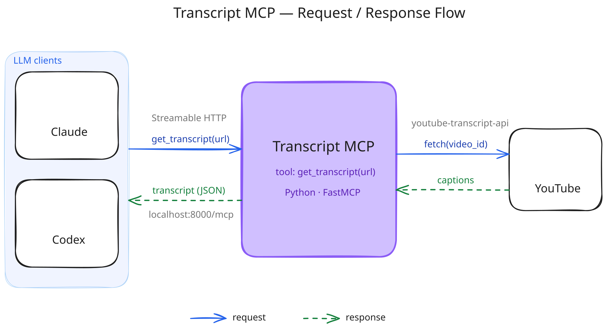
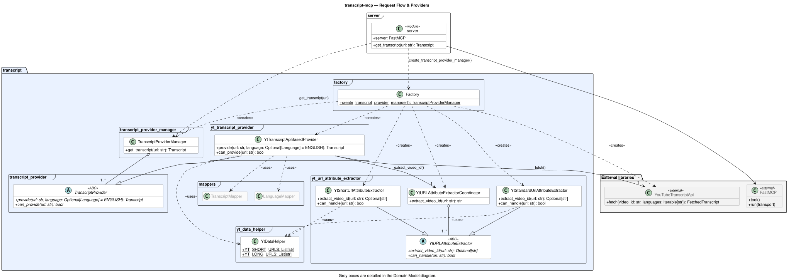
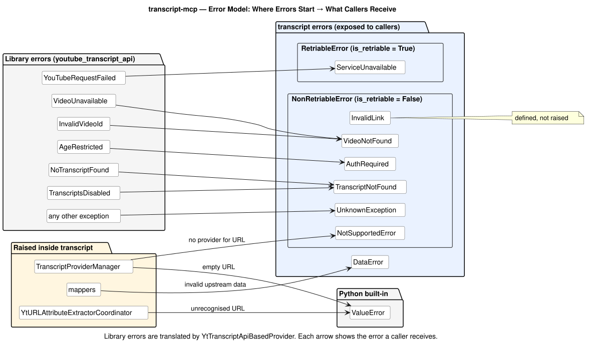

# transcript-mcp

MCP server that downloads video transcripts. Supports YouTube.

## Architecture

The editable source is [`docs/architecture.excalidraw`](docs/architecture.excalidraw). Open it at [excalidraw.com](https://excalidraw.com), then re-export `docs/architecture.svg` after changes so the two stay in sync.

## Low-level design

Class diagrams of the `transcript` package, showing public members only. Click a diagram to open it at full size.

### Request flow

How a `get_transcript` call travels from the MCP server through the `transcript` package to the YouTube Transcript API.

### Domain model

How the library's response objects are translated into the package's own domain entities by the mappers.

### Error model

Where each error starts and what the caller receives. Library errors are translated by `YtTranscriptApiBasedProvider`; the package's own errors are grouped by whether they are retriable.

The PlantUML sources are in [`docs/uml/`](docs/uml/). After editing a `.puml` file, re-render its `.svg` with PlantUML so the two stay in sync.
